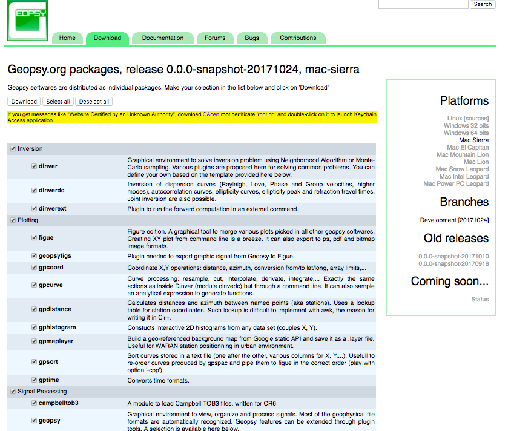
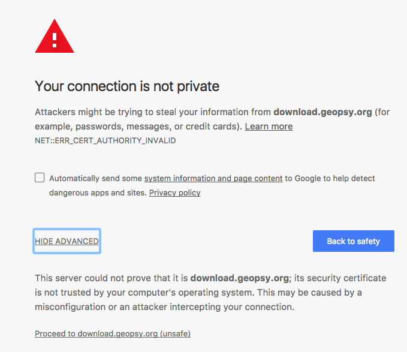
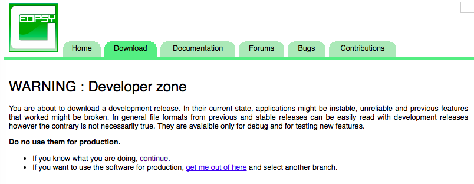
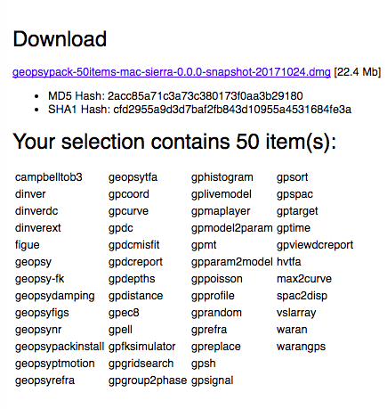
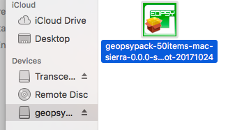
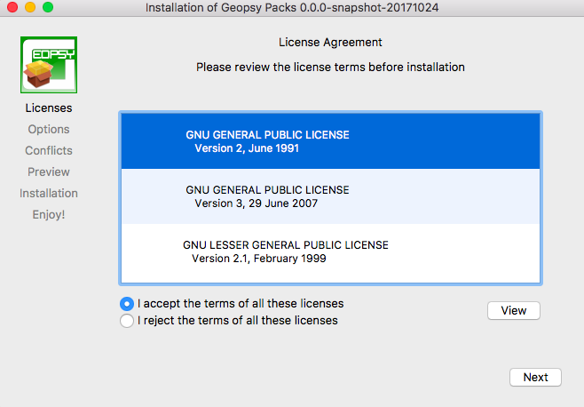
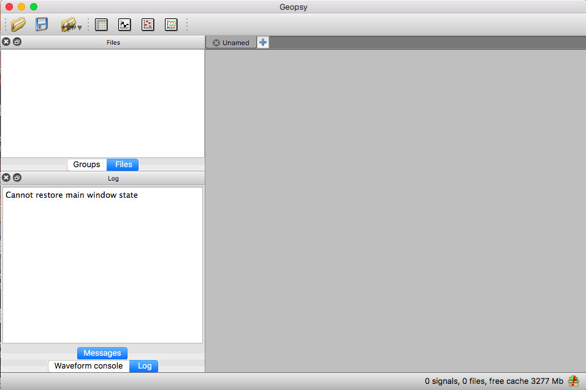

# HVSR
H/V Spectral Ratio

***

## Introduction of this project

An important predictive variable for site amplification is the site fundamental frequency (f0), which is correlated with the thickness and shear-wave velocity (VS) of the soil layer. At permanent (or long-term) seismic monitoring stations, f0 is obtained from the peak of the horizontal-to-vertical spectral ratios (eHVSR) estimated from earthquake recordings. For site characterization projects, f0 is commonly obtained from mHVSR estimated from microseismic (ambient noise) observations recorded by short-term three-component single-station arrays—note that in the mHVSR case, the f0 is generally obtained from the Fourier spectrum rather than the response spectrum. 

In this study, we compare the f0 values obtained from earthquake recordings (eHVSR) with those derived from microseism (mHVSR). For the eHVSR, we use the response spectra from the Next-Generation-Attenuation-West2 database (Ancheta et al., 2014). 

For the mHVSR, we use data acquired from the Yong et al. (2013) VS30 site characterization project. The database includes mHVSR estimated from multiple closely-located single-station recordings conducted near each of 187 seismic stations in California. 

Comparing the f0 values from the eHVSR response spectra data to those from the mHVSR data for the sites show that eHVSR f0 values for response spectra scale linearly with mHVSR f0 values. The eHVSR f0 values from response spectra are on average 0.80 times the f0 values from mHVSR Fourier spectra, with a standard deviation of 0.25. The relationship holds for microseismic surveys at distances up to 300 m away from the seismic stations. The results of this study have significant applications for better characterizing the site response in modern ground-motion prediction equation models as well as in building codes.

## INSTALL GEOPSY

* Step 1: Go to http://www.geopsy.org/download.php , select all component to download and select the correct platform. 

* Step 2: The browser might block you from downloading becasue of safety problem

* Step 3: Click on `Advance` button and Processed to `download.geopey.org`, you would follow the link to down the software.

***

* Step 4: Click on the `XX.XX.dmg` file, and you would found the icon like this.

* Step 5: If you have some problem to open the icon, you could check your `Security & Privacy` setting to allow the apps run.

* Step 6: You continue to install the program. You also need to provide your `sudo passwd`. When you succeed, you would see the windows like this:

## Workflow

* Follow the instruction of ` HVSR Processing in Geopsy.pdf ` , this instruction would show you how to read data, select window and achieve HVSR.

* You also need to save the figures and the spectrum data (digitized data) for the later analysis.

* Write a scripts or function to find the peak of spectrum. If possible, find the second largest peak and double peaks.

* Compare the result with my previous ` HVSR_tian.xlsx `.

